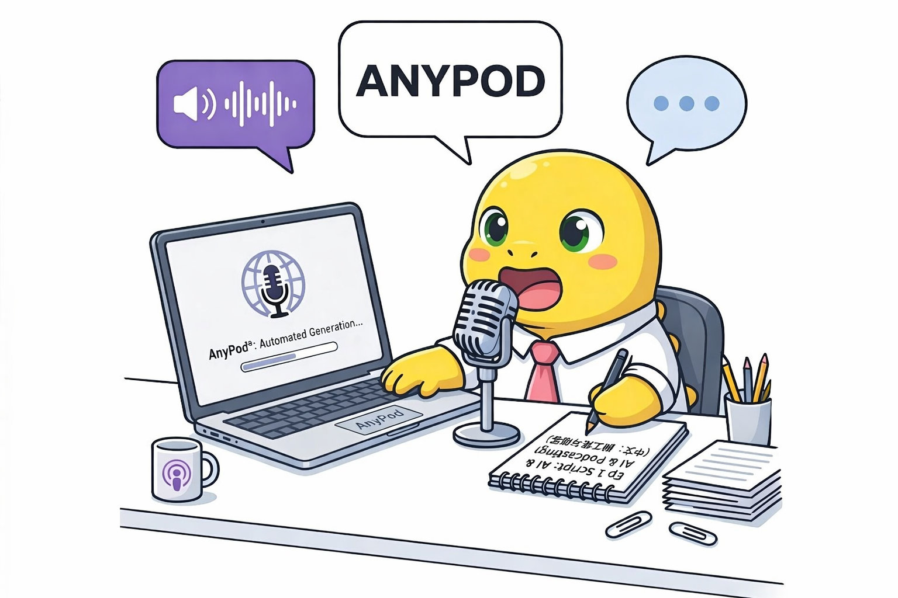

[English](README.md) | [简体中文](README_zh.md)

# AnyPod

 <p align="center">
    
  </p>

  <br>

AnyPod is an open-source automated podcast generation tool powered by open-source TTS models such as MOSS-TTSD. It transforms any text input (TXT/PDF) into a multi-episode, high-quality podcast. The tool leverages LLM agents to automatically analyze input text, plan podcast content, generate scripts, and synthesize speech via TTS. It supports custom voice cloning, editable show settings and scripts, and bilingual input/output in both English and Chinese.

## Installation

This tool supports four TTS backends:

- **MOSS-TTSD (8B)**: best overall quality (recommended).
- **MOSS-TTS (8B)**: best quality for single-speaker generation.
- **VibeVoice (1.5B)**: lightweight option for most personal devices.
- **MOSS-TTS API**: easiest setup, but single-speaker only.

### Set Up a TTS Environment

**If you are using MOSS-TTS / MOSS-TTSD as the TTS backend:**

```bash
# Create the MOSS-TTS / MOSS-TTSD environment
conda create -n anypod_moss_tts python=3.11 -y
conda activate anypod_moss_tts
pip install -r requirements_moss_tts.txt
pip install flash-attn  # Install FlashAttention (optional)

# Download model weights
huggingface-cli download OpenMOSS-Team/MOSS-Audio-Tokenizer \
  --local-dir model/MOSS-Audio-Tokenizer \
  --local-dir-use-symlinks False

huggingface-cli download OpenMOSS-Team/MOSS-TTSD-v1.0 \
  --local-dir model/MOSS-TTSD-v1.0 \
  --local-dir-use-symlinks False

huggingface-cli download OpenMOSS-Team/MOSS-TTS \
  --local-dir model/MOSS-TTS \
  --local-dir-use-symlinks False
```

**If you are using VibeVoice as the TTS backend:**

```bash
# Create the VibeVoice environment
conda create -n anypod_vibevoice python=3.11 -y
conda activate anypod_vibevoice
pip install -r requirements_vibevoice.txt

# Download model weights
huggingface-cli download microsoft/VibeVoice-1.5B \
  --local-dir model/VibeVoice-1.5B \
  --local-dir-use-symlinks False

python -c "
from transformers import AutoTokenizer
tokenizer = AutoTokenizer.from_pretrained('Qwen/Qwen2.5-1.5B')
tokenizer.save_pretrained('model/Qwen2.5-1.5B-tokenizer')
print('Done')
"
```

**If you are using MOSS-TTS API as the TTS backend:**

No additional TTS environment is needed. Simply configure your API key and voice ID in `config/llm_api_config.json` under the `moss_tts_api` section.

### Set Up the Base Environment

```bash
conda create -n anypod python=3.11 -y
conda activate anypod
pip install -r requirements.txt
export ANYPOD_CONDA_HOME=YOUR_CONDA_PATH  # e.g., ~/miniconda3
```

## LLM Agent Configuration

Configure the LLM agents used by AnyPod in `config/llm_api_config.json`. The following fields are required for each agent:

```json
{
  "base_url": "",
  "model": "",
  "api_key": ""
}
```

There are three agents, each suited to a different type of model:

- **understanding_agent** — A lightweight model is recommended for cost efficiency (e.g., Qwen3-Flash).
- **plan_agent** — A model with strong reasoning capabilities is recommended (e.g., GPT-5.4 Thinking).
- **writing_agent** — A model with strong writing capabilities is recommended (e.g., Gemini 3 Flash/Pro).

## Usage

### Run via Gradio Web UI

```bash
python gradio_main.py \
  --server_name 127.0.0.1 \
  --server_port 7860
```

### Run via Command Line

```bash
python main.py \
  --config_json config/anypod_config.json
```

Edit `config/anypod_config.json` to set input parameters.

## Coming Soon

- Support for more TTS models.
- Support for more languages and additional speakers.
- Support for more input types and modalities (e.g., image-based PDFs).
- Windows / macOS / Android apps.

## Contributing

Contributions are welcome!

1. Fork the repository
2. Create a feature branch
3. Make your changes
4. Submit a pull request

## License

This project is licensed under the [MIT License](LICENSE).
